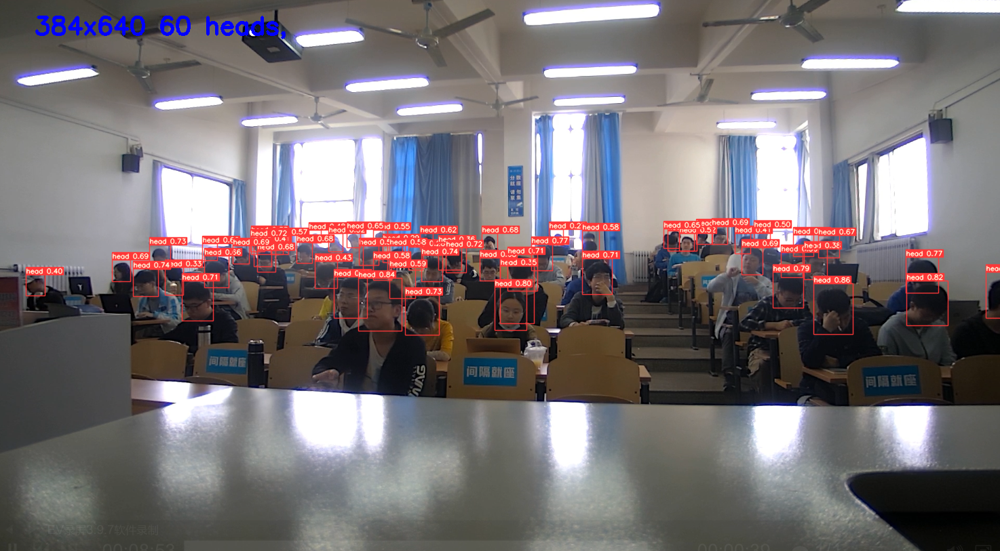

# yolo-student-counter


Monitor in classroom headcount, support image/video/live streaming as input. 基于YOLOv5的教室人数检测统计，支持图片、视频和直播流等多种媒体输入格式

```
.
├── dataset # 数据集
│   ├── annotations # XML 标签
│   ├── images # 图片
│   └── labels # txt 标签
├── detect.sh # detect shell 脚本
├── hellodata.py # 数据探索、预处理
├── LICENSE
├── README.md
├── res
│   ├── demo_picture1.png # 样例图片
│   └── demo_picture2.png
├── runs
│   ├── detect # 训练后的文件结果
│   └── train # 训练后的权重
├── train.sh # train shell 脚本
├── xml2txt.py # 将 XML 转换为 txt 标签
└── yolov5 # 从 @ultralytics/yolov5 clone
    ├── data
    │   ├── coco.yaml
    │   ├── headset.yaml # 自定义训练集
    │   ├── hyp.scratch.yaml
    │   ├── images # 存放 detect 输入数据
    │   │   ├── bus.jpg
    │   │   └── zidane.jpg
    │   └── videos # 存放 detect 输入数据
    ├── detect.py
    ├── Dockerfile
    ├── hubconf.py
    ├── models # 预训练模型 YAML 文件
    ├── requirements.txt # Python 依赖库
    ├── test.py
    ├── train.py
    ├── utils
    └── weights # 预训练权重
```

## 1 Overview

- 目标检测 (Object Detection) 在教室人数统计上的应用尝试
- 先借助 [YOLOv5](https://github.com/ultralytics/yolov5) 预训练模型对图片数据集进行训练，再测试多种输入流
- 数据集下载：[Classroom Monitoring Dataset - kaggle](https://www.kaggle.com/lunarwhite/classroom-monitoring-dataset)
  - images 图片
    - partA 2000张，格式： `[PartA_num].jpg`
    - partB 2405张，格式：`[PartB_num].jpg`
  - annotations 标签，标注了图片中 目标的类别和坐标位置
    - partA 2000条，格式：`[PartA_num].xml`
    - partB 2405条，格式：`[PartB_num].xml`
- 主要工具包版本为 PyTorch `1.7.1+cu110` 和 Python `3.8.5`

## 2 Setup

- clone repo：`git clone https://github.com/lunarwhite/yolo-student-counter.git`
- 更新 pip：`pip3 install --upgrade pip`
- 为项目创建虚拟环境：`conda create --name <env_name> python=3.8`
- 激活 env：`conda activate <env_name>`
- 安装 Python 库依赖：`pip3 install -r yolov5/requirements.txt`
- [下载](https://github.com/ultralytics/yolov5/releases)预训练权重，把下载的 `.pt` 文件部署在 `yolov5/weights/` 路径下

## 3 Train

- 为了方便执行，编写了脚本 [detect.sh](./detect.sh) 和 [train.sh](./train.sh)，分别进行训练与预测测试
- 根据训练效果调整 `train.sh` 文件中常用参数：
  ```python
  --epochs # 训练的 epoch，默认值 300
  --batch-size # 默认值 16
  --cfg yolov5s.yaml --weights '' # 从头开始训练
  --cfg yolov5s.yaml --weights yolov5s.pt # 从预训练模型开始训练
  --data # 数据集的配置文件，默认为 data/coco128.yaml
  --resume # 是否从最新的 last.pt 中恢复训练，布尔值
  --evolve # 进化超参数 (Evolve Hyperparameters)，布尔值
  --cache-images # 缓存图片可以更快的开始训练，布尔值
  --weights # 初始化参数路径，默认值 ''
  --adam # 使用 adam 优化器，布尔值
  ```
- 一般只需改动这两个脚本文件就可，如需训练自定义的数据集，请参考官方文档：[Train Custom Data - YOLOv5 Documentation](https://docs.ultralytics.com/yolov5/tutorials/train_custom_data/)

## 4 Workflow

- 自定义数据集
- 观察数据
  - 数据集大小
  - 数据集样本
  - 图像分辨率  
- 数据预处理
  - 数据清洗，观察发现，有一些图像的 label 存在缺失，在 `XML` 转换 `TXT` 的过程中一并丢弃
  - YOLOv5 原生预处理
- 搭建模型，可视化分析
  - 分析与调整训练，提高模型泛化能力
  - demo 的 detect 结果：
    
    
- 改进模型
  - 可视化图形界面 [TODO]
  - 优化目录结构，提高封装性 [TODO]

## 5 Reference

- [Getting Started - YOLOv5 Documentation](https://docs.ultralytics.com/yolov5/quickstart_tutorial/)
- [Train Custom Data - YOLOv5 Documentation](https://docs.ultralytics.com/yolov5/tutorials/train_custom_data/)
- [Tips for Best Training Results - YOLOv5 Documentation]( https://github.com/ultralytics/yolov5/wiki/Tips-for-Best-Training-Results)
- [Transfer Learning with Frozen Layers - YOLOv5 Documentation](https://github.com/ultralytics/yolov5/issues/1314)
